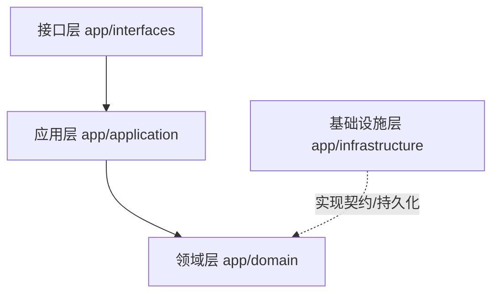

# HMP WS Service — 欢乐斗地主 (Happy Dou Di Zhu)

本项目是一个采用前后端彻底分离架构的“欢乐斗地主”网络对战系统。系统以 **FastAPI + Vue 3** 为核心，搭配 **Redis** 存储匹配队列与对局状态，以及 **MySQL** 落地存储战绩与玩家档案。系统内置了强健的掉线重连机制与自研扑克牌规则引擎，并提供独立的 AI 降级接管机器人，实现了极佳的可玩性与开发调试体验。

---

## 🎨 游戏界面巡礼 (Screenshot Tour)

### 1. 账号登录与注册页
玩家通过唯一的账号或昵称快捷注册与登录，进入持久化游戏大厅，所有的欢乐豆和段位战绩将绑定账号，终局持久化。


### 2. 多人游戏大厅
支持底分不同的六大段位场次选择；集成全局欢乐豆富豪排行榜；界面采用流畅的玻璃态毛玻璃视觉设计。


### 3. 实时对局房间
支持逼真的实时叫地主、抢地主、加倍与出牌交互。游戏界面包含精细的头像标识、手牌排列、上家出牌反馈、剩牌提示以及气泡短语聊天。


### 4. HMP 系统调试控制台
为开发与运维人员量身打造的控制台。支持 WebSocket 文本消息调试、广播站内信发送与接收、大文件并发分片上传进度条展示以及系统审计日志的高级筛选与气泡预览。
```text
体验开发 Mock 模式：
如果在前端开发环境下，在 URL 后面附带 `?mock=true` 参数，例如：
http://localhost:5173/lobby?mock=true 
即可在无需启动后端的情况下直接体验和预览完整的前端交互界面！
```


---

## 📂 项目架构与 DDD 落地实践

后端服务采用 **DDD (Domain-Driven Design, 领域驱动设计)** 进行分层组织，严格隔离业务核心与基础设施实现：



### 1. 各层职责划分

* **领域层 (`backend/app/domain/`)**：
  - **无外部依赖的纯业务逻辑**：定义扑克牌编码、排序、洗牌 (`card.py`) 与 14 种斗地主常见牌型的智能校验与 `can_beat` 压制判定算法 (`card_type.py`)。
  - **房间状态机 (`room.py`)**：严密的五大阶段状态转换 (`MATCHING` -> `DEALING` -> `CALLING` -> `PLAYING` -> `SETTLING`)，规避前后端状态不一致。
* **应用层 (`backend/app/application/`)**：
  - **业务流程编排**：由 `GameAppService` 统一提供匹配排队、自动开局、AI 机器人补齐席位、叫地主/出牌的流程驱动。
* **基础设施层 (`backend/app/infrastructure/`)**：
  - **持久化与外部依赖**：提供 MySQL 的 SQLAlchemy 数据模型与持久化仓储 (`game_repository.py`)、Redis 匹配队列与房间缓存仓储 (`redis_game_repository.py`)、RabbitMQ 站内信广播适配器。
* **接口层 (`backend/app/interfaces/`)**：
  - **外部通信网关**：包含面向普通 REST 的游戏 API (`api/game_routes.py`)，提供大文件 WebSocket 分片上传路由与 WebSocket 调试接口，以及斗地主的核心 WebSocket 对战网关 (`websocket/game_routes.py`)。

---

## ⚡ WebSocket 核心交互协议

对局过程完全基于 WebSocket 事件驱动交互。核心交互事件协议如下：

### 1. 客户端发起动作 (Client Actions)
客户端往对战网关发送消息时使用统一格式：`{"action": "动作名", ...}`

* **开始匹配 / 取消匹配**：
  ```json
  {"action": "join_match", "nickname": "玩家昵称", "base_score": 80}
  {"action": "cancel_match"}
  ```
* **叫地主 / 不叫 / 抢地主 / 不抢**：
  ```json
  {"action": "call_landlord", "score": 3}
  {"action": "skip_call"}
  ```
* **加倍 / 超级加倍 / 不加倍**：
  ```json
  {"action": "choose_doubling", "choice": "double"} // choice 可选: double | super | none
  ```
* **出牌 / 过牌**：
  ```json
  {"action": "play_cards", "cards": [48, 49, 50]} // 传入出牌 ID 数组
  {"action": "pass_turn"}
  ```

### 2. 服务端广播事件 (Server Events)
服务端会根据不同事件向房间内玩家推送更新。为保证游戏公平性，向不同座席广播时会调用 `GameRoom.get_player_view(player_id)`，隐藏他人手牌并只暴露其余手牌张数。

* **对局开始 (`game_start`)**：
  ```json
  {
    "event": "game_start",
    "room_id": "room_xxx",
    "hand": [53, 52, 50, 49, 48], // 当前玩家被分配的手牌 ID 列表
    "current_turn": "player_123",  // 第一个叫分的座席 ID
    "turn_deadline": 1782390120,   // 当前回合超时的绝对时间戳
    "players": [
      {"id": "p1", "nickname": "玩家A", "is_ai": false, "remaining": 17},
      {"id": "p2", "nickname": "机器人", "is_ai": true, "remaining": 17}
    ]
  }
  ```
* **地主确定 (`landlord_decided`)**：
  ```json
  {
    "event": "landlord_decided",
    "landlord": "p1",
    "bottom_cards": [51, 47, 43], // 广播三张明面底牌
    "multiplier": 2                // 当前房间倍数翻倍
  }
  ```
* **出牌成功 (`cards_played`)**：
  ```json
  {
    "event": "cards_played",
    "player": "p1",
    "cards": [48, 49, 50],
    "card_type": "triple",         // 智能识别的牌型
    "next_turn": "p2"              // 下一个出牌回合的玩家 ID
  }
  ```

---

## 🛠️ 技术栈

### 后端
- **核心框架**: FastAPI (Python 3.10+) 异步底座
- **数据流与缓存**: Redis (提供匹配队列与高性能房间状态读写，TTL 2小时自清理)
- **关系型数据库**: MySQL 5.7+ / SQLite (SQLAlchemy 2.0 异步驱动与 Alembic 自动迁移)
- **消息队列**: RabbitMQ (用于站内信广播通知)
- **测试**: pytest + pytest-asyncio (覆盖率达 90% 以上)

### 前端
- **核心框架**: Vue 3 (Composition API) + TypeScript
- **构建工具**: Vite 8.0+
- **状态管理**: Pinia
- **路由系统**: Vue Router 4
- **音频引擎**: 自研 useSoundEngine (支持背景音与动作音效异步解码播放)

---

## 🙏 开源依赖与鸣谢 (Credits & Dependencies)

本项目在开发过程中，深受开源社区众多优秀项目启发与支撑，特此向以下 GitHub 优质开源项目及团队致以最诚挚的敬意：

### 1. 算法与决策 AI 模型
* **[kwai/douzero](https://github.com/kwai/douzero)** — 经典的基于强化学习（Deep Monte-Carlo, DMC）的斗地主 AI 训练框架。本项目在其研究成果基础上设计了模型推理层适配器，并在此基础上提供了平滑的规则 AI 降级机制。

### 2. 后端异步生态依赖
* **[tiangolo/fastapi](https://github.com/tiangolo/fastapi)** — 高性能、易学、快速编写代码的异步 Web 框架。
* **[sqlalchemy/sqlalchemy](https://github.com/sqlalchemy/sqlalchemy)** — 极具工业强度且设计优雅的 Python SQL 工具包与 ORM 映射器。
* **[redis/redis-py](https://github.com/redis/redis-py)** — 强大的 Redis 异步 Python 客户端驱动，提供了极其稳定的连接池管理。
* **[mosbrupture/aio-pika](https://github.com/mosbrupture/aio-pika)** — 专为 asyncio 打造的 RabbitMQ 异步驱动，本项目在此之上构建了高可用的站内信广播机制。

### 3. 前端响应式生态依赖
* **[vuejs/core](https://github.com/vuejs/core)** — 渐进式 JavaScript 框架，为斗地主界面提供了极致流畅的局部刷新与响应式视图同步。
* **[vitejs/vite](https://github.com/vitejs/vite)** — 极速的下一代前端开发与构建工具，极大加速了本地 HMR 调试效率。
* **[vuejs/pinia](https://github.com/vuejs/pinia)** — 专为 Vue 打造的轻量状态管理库，使游戏内多端数据流、玩家档案和叫牌状态一目了然。

---

## 🚀 快速启动指南

### 1. 后端配置与启动
1. 进入后端目录：
   ```bash
   cd backend
   ```
2. 配置环境变量 `.env`：
   ```ini
   PORT=18088
   DB_HOST=127.0.0.1
   DB_PORT=3306
   DB_USER=root
   DB_PASSWORD=your_password
   DB_NAME=hmp_websocket
   REDIS_HOST=127.0.0.1
   REDIS_PORT=6379
   ```
3. 安装依赖并启动：
   ```bash
   pip install -r requirements.txt
   python main.py
   ```
   * 后端启动时会自动在 MySQL 中完成缺表检测与自愈字段补齐。

### 2. 前端配置与启动
1. 进入前端目录：
   ```bash
   cd frontend
   ```
2. 安装依赖并运行开发服务器：
   ```bash
   npm install
   npm run dev
   ```
3. 访问 `http://localhost:5173`。

---

## 🏆 独特排位头衔系统 (Rank System)

游戏包含一套富有趣味的 **36 级特色排位头衔系统**，玩家通过赢取星星提升段位，展现身价头衔。

### 1. 36级头衔一览
头衔由低到高划分为 36 个大级别：
- **新手期 (1-9级)**：`包身工`、`短工`、`长工`、`中农`、`富农`、`掌柜`、`商人`、`小财主`、`大财主`。
- **中产期 (10-21级)**：`县尉`、`县丞`、`县令`、`通判`、`主事`、`知府`、`员外郎`、`郎中`、`侍郎`、`巡抚`、`总督`、`尚书`。
- **达贵期 (22-35级)**：`大学士`、`太保`、`太傅`、`太师`、`三等伯`、`二等伯`、`一等伯`、`三等侯`、`二等侯`、`一等侯`、`辅国公`、`镇国公`、`郡王`、`亲王`。
- **终极大满贯 (36级)**：`至尊`。

> 除【至尊】外，每个头衔划分为 `IV, III, II, I` 四个子级别。

### 2. 升降星状态机规则
后端通过 `SQLGameRepository` 在每局终局结算时对段位执行原子变动：
* **爆发胜利加星**：普通胜利积 **1 星**；使用炸弹/王炸或者以春天获胜（爆发性胜利），星星 **+2**。
* **新手保护机制 (1-9级)**：小段位满 **3 星** 即可晋级；输牌不扣星，不降段。
* **中大段位保护 (10-21级)**：小段位满 **4 星** 晋级；输牌扣 **1 星**；大段位触发保护机制（例如不会从“县尉IV”降回“大财主I”）。
* **无保护硬核博弈 (22-35级)**：小段位满 **5 星** 晋级；输牌扣 **1 星**；段位无任何保护（降星可直接跌落大级别）。

---

## 🤖 托管 AI 决策与降级策略

对局系统集成了高可用的 AI 机制，保障流畅的网络对战体验：

1. **自动补位与托管**：匹配等待超时 10 秒后，AI 机器人将自动补齐空位开局；对局中玩家掉线时，AI 会无缝接管出牌。
2. **双层决策引擎**：
   - **DouZero 强化学习 AI**：优先调用基于 DeepMind 强化学习训练的 DouZero AI 进行精细的算牌与出牌决策。
   - **规则兜底 (Rule-based AI)**：若 DouZero 推理模型未加载或出现计算异常，系统会瞬间降级到规则 AI，依据手牌顺位、大牌压制等预设规则执行合理出牌，保障人机对战完全不中断。

---

## 🧪 单元测试

运行以下命令执行全自动单元测试，验证核心领域规则：

* **后端测试** (覆盖领域模型、AI 叫牌判定、大文件安全分片等)：
  ```bash
  cd backend
  python -m pytest tests/ -v
  ```
* **前端测试**：
  ```bash
  cd frontend
  npm run test:unit
  ```
