# 审计日志自动拦截设计规范 (APIRoute 方案)

## 1. 概述
在原有的审计日志方案中，每次进行业务写操作时都需要手动引入 `audit_service` 并在 API Handler 中通过 try-except 手写审计日志记录。这种手动埋点会导致代码臃肿，难于维护，并且存在漏记风险。
本设计规范通过 FastAPI 原生的 APIRoute 拦截机制，结合接口元数据（summary/description），实现了非侵入式的、自动的、线程安全的审计日志记录。

## 2. 架构设计

### 2.1 自定义路由类 `AuditLogRoute`
通过继承 `fastapi.routing.APIRoute` 并重写 `get_route_handler` 方法，对拦截到的请求与响应执行生命周期钩子：
1. **元数据声明感应**：只有路由的 `summary` 在可审计列表（如 `SEND_MESSAGE`, `READ_MESSAGE`, `READ_ALL_MESSAGES`, `DELETE_FILE`）中时，才会执行审计流程。
2. **多线程 Session 隔离**：在后台线程内部创建和销毁独立的数据库 Session（通过 `SessionLocal()`），彻底规避跨线程共享/操作 SQLAlchemy Session 所导致的连接卡死或死锁。
3. **零拷贝响应体读取**：只有在需要提取消息 ID 的特定成功写动作（`SEND_MESSAGE`）中才会安全地读取 `response.body_iterator`。对于大文件下载、流式响应或常规的业务接口，一律不进行流读取，完全消除内存暴涨与大文件流损坏的风险。
4. **参数自动解包**：直接从 `request.path_params` 提取 `message_id`/`file_id`，避免正则硬编码匹配。
5. **异常与失败捕获**：自动包裹执行链，如遇异常抛出，则捕获之，记录 `status="failed"` 审计日志后重新抛出异常，维持原样响应。

### 2.2 类图与流程设计 (Mermaid)

```mermaid
sequenceDiagram
    participant Client as 客户端
    participant AuditRoute as AuditLogRoute 拦截器
    participant Handler as 业务 Handler
    participant DbSession as 独立工作线程 SessionLocal
    participant Db as MySQL 数据库

    Client->>AuditRoute: 发送 HTTP API 请求
    activate AuditRoute
    rect rgb(30, 40, 50)
        Note over AuditRoute: 备份 Body (如果是 SEND_MESSAGE)<br/>提取路径/查询参数 (如 file_id, receiver)
    end
    AuditRoute->>Handler: 调用原始 Handler
    activate Handler
    Handler-->>AuditRoute: 返回 Response (或抛出 Exception)
    deactivate Handler

    alt 执行成功
        rect rgb(20, 50, 30)
            Note over AuditRoute: 提取响应内生成的 ID (发送消息场景)<br/>状态置为 success
        end
    else 捕获到异常/HTTP错误
        rect rgb(60, 20, 20)
            Note over AuditRoute: 提取异常描述/状态码<br/>状态置为 failed
        end
    end

    Note over AuditRoute: 派发异步工作线程 (to_thread)
    AuditRoute->>DbSession: 线程内创建 SessionLocal
    activate DbSession
    DbSession->>Db: 插入 audit_log 数据记录
    DbSession->>DbSession: 提交 (commit) 并关闭 (close)
    deactivate DbSession

    AuditRoute-->>Client: 返回原始响应
    deactivate AuditRoute
```

## 3. 具体修改规约

### 3.1 新增文件：[audit_route.py](file:///d:/Project_2023/hmp_ws_service/app/infrastructure/audit_route.py)
用于承载 `AuditLogRoute` 的具体拦截与日志组装逻辑。

### 3.2 路由重构说明

#### [message_routes.py](file:///d:/Project_2023/hmp_ws_service/app/interfaces/api/message_routes.py)
1. 在 `APIRouter` 实例化中传入 `route_class=AuditLogRoute`。
2. 更改接口装饰器属性：
   - `send_message_api`: `summary="SEND_MESSAGE"`, `description="site_message"`
   - `mark_as_read_api`: `summary="READ_MESSAGE"`, `description="site_message"`
   - `mark_all_as_read_api`: `summary="READ_ALL_MESSAGES"`, `description="site_message"`
3. 清除 `audit_service` 依赖注入及大段 `await audit_service.record_log` 逻辑。

#### [upload_routes.py](file:///d:/Project_2023/hmp_ws_service/app/interfaces/api/upload_routes.py)
1. 在 `APIRouter` 实例化中传入 `route_class=AuditLogRoute`。
2. 更改接口属性：
   - `delete_uploaded_file`: `summary="DELETE_FILE"`, `description="uploaded_file"`
3. 清除内部所有对 `audit_service.record_log` 的手动调用与 `try-except` 包裹，使业务逻辑直接抛出。

### 3.3 WebSocket 审计边界
文件上传与合并（`UPLOAD_FILE`）属于非标准 HTTP 动作，依旧在 WebSocket 处理器 `app/interfaces/websocket/handler.py` 中进行手动拦截录入，不通过此中间件。

## 4. 验证方案
1. 启动服务，进行发送消息与删除文件测试。
2. 切换到“审计日志”页签，查看是否能正确获取和过滤展示。
